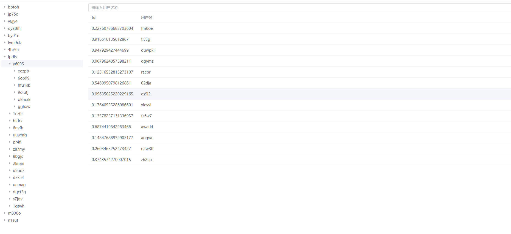

# Hixtrip FE Online

## 准备

- fork 此仓库
- 根据如下要求实现相关代码
- 完成要求
  - 提交`pull request`
  - 提供页面截图

## 需求

1. 目前已经有`src/api/user.ts` 以及 `src/api/org.ts` 两个 API
2. 需要实现如下效果界面：


> 功能要求：

- 不限 `React` 或者 `Vue`
- 需要拆分 `OrgTree` 以及 `UserTable` 两个组件
  - 两个组件自己维护相关的数据。
  - 体现两个组件的互相通信。
- 组织架构根据点上级节点进行查询子级节点实现异步加载。
- 用户 `Table ` 数据跟据点击 `组织架构树形节点` 以及 `输入搜索关键字` 查询。
  - 需要考虑防抖节流等功能点
- 风格不限
  - 示例图仅仅是效果展示，不需要完全符合。
  - 可以使用 `UI Framework`, 如 `ant-design`, `element-ui`等
  - 如果不用`UI Framework`, 可以直接用原生的`<ul> <li>`, `<table>` 实现，不用实现相关的 CSS 样式, 可以加分。

## 页面截图
  

## 其他简答题

### 如何将如下的`JSON`正确解析成 `Object`

```json
{
  "userId": 111323290434354540545
}
```

```json
  JSON.parse('{ "userId": 111323290434354540545 }')
```

### 前端需要*稳定*每隔`1s`向服务端请求`API`, 请问如何实现？

function fetchData() {
// 创建一个 Promise 来处理 API 请求
const request = fetch('your-api-endpoint-url')
.then(response => {
if (response.ok) {
return response.json(); // 解析 JSON 响应
}
throw new Error('Network response was not ok.');
})
.catch(error => {
console.error('There has been a problem with your fetch operation:', error);
});
}
// 使用 setInterval 设置定时器，每隔 1 秒调用 fetchData 函数
const intervalId = setInterval(fetchData, 1000);

beforeDestory: () => {
clearInterval(intervalId);
}

### 什么情况下，你会为你的项目引入状态管理库，比如`Redux`, `Pinia`, 可以简述一下起到了什么作用么？

跨组件传递数据的时候使用，例如购物车，用户信息等；可以使全局数据共享，状态统一，便于管理，便于维护。

### 为什么`ESM`与`CJS`不能兼容？
esm 是基于模块化的，cjs 是基于 CommonJS 的，所以不能兼容。
首先：cjs 模块输出的是一个值的拷贝，ES6 模块输出的是值的引用；
其次：ES6 模块是编译时输出接口，CommonJS 模块是运行时加载；
最后：esm 的 import 命令是异步加载，有一个独立的模块依赖的解析阶段,cjs 的 require()是同步加载模块；
